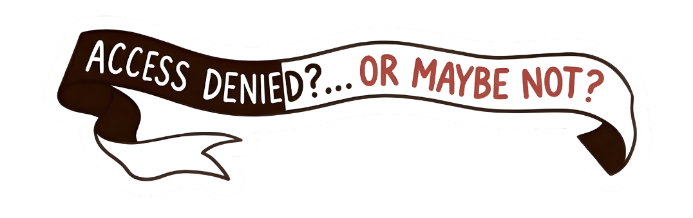
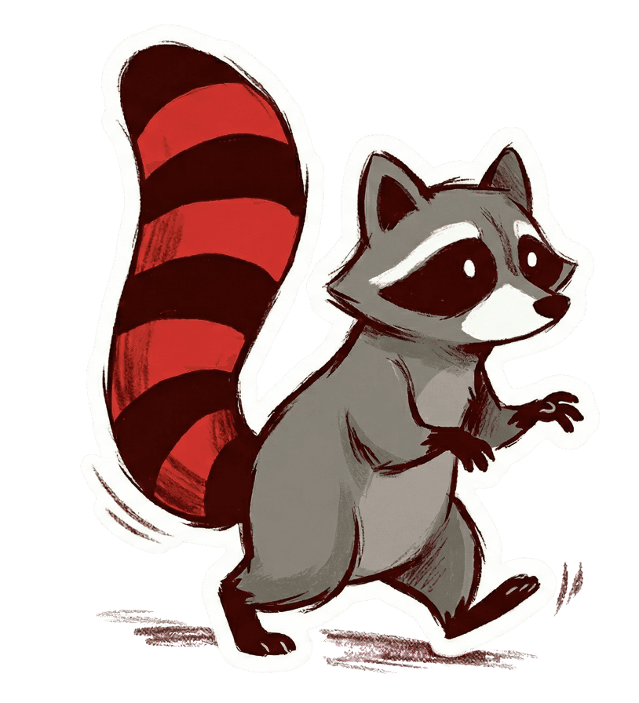
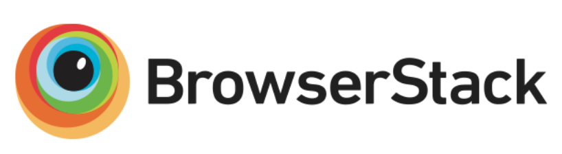
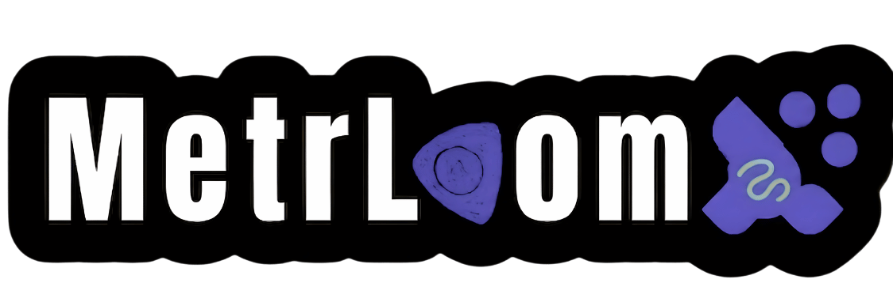

<p align="center">
  
</p>

<p align="center">
  <a href="https://access.denied.online">This is the public version of access.denied.online</a>
</p>

---

A Capture The Flag (CTF) competition built to teach students how real-world security vulnerabilities work in Backend-as-a-Service platforms. Players exploit intentionally flawed Appwrite configurations across 4 progressive phases, learning to identify and fix critical security issues in their own projects.

<p align="center">
  
</p>

## Details

This is the main public Access Denied CTF website with the Passwordless Auth system, team management, rules and prizes info, scoreboard, and phase details.

The competition contains 4 main phases and a sub-event for students to submit open source projects to be reviewed by the Access Denied team based on their data security & permissions system strength.

*The phases code will be available after the competition ends.*

## Tech Stack

- Vanilla HTML/CSS/JS (no frameworks)
- [Appwrite](https://appwrite.io) for backend (auth, database, functions)
- [Vite](https://vitejs.dev) for build tooling
- [DiceBear](https://dicebear.com) for avatar generation


## Project Structure

```
├── index.html              # landing page
├── login.html              # magic link + google login
├── signup.html             # registration
├── account.html            # profile + team management
├── scoreboard.html         # leaderboard
├── rules.html              # rules and prizes
├── about.html              # about the initiative
├── src/
│   ├── css/                # modular stylesheets
│   └── js/                 # modular scripts
│       ├── appwrite.js     # appwrite client setup
│       ├── auth-flow.js    # authentication logic
│       ├── account-page.js # profile management
│       ├── teams.js        # team ui logic
│       ├── scoreboard.js   # leaderboard rendering
│       ├── modal.js        # custom dialog system
│       ├── toast.js        # toast notifications
│       ├── nav.js          # dynamic navigation
│       ├── script.js       # homepage + footprints
│       ├── footer.js       # footer component
│       └── utils.js        # shared utilities
└── .env.example            # environment template
```
---


## Sponsors & Supporters

<p align="center">
  <strong>Sponsored by</strong>
  <br><br>
  <a href="https://www.browserstack.com">
    
  </a>
  <br>
  <sub>This project is tested with BrowserStack. BrowserStack sponsors the testing infrastructure for this project.</sub>
</p>

<br>

<p align="center">
  <strong>Supported by</strong>
  <br><br>
  <a href="https://metrloom.com">
    
  </a>
</p>


---

<p align="center">
  <sub>This competition is organized for students of Assiut STEM School.</sub>
</p>

---
